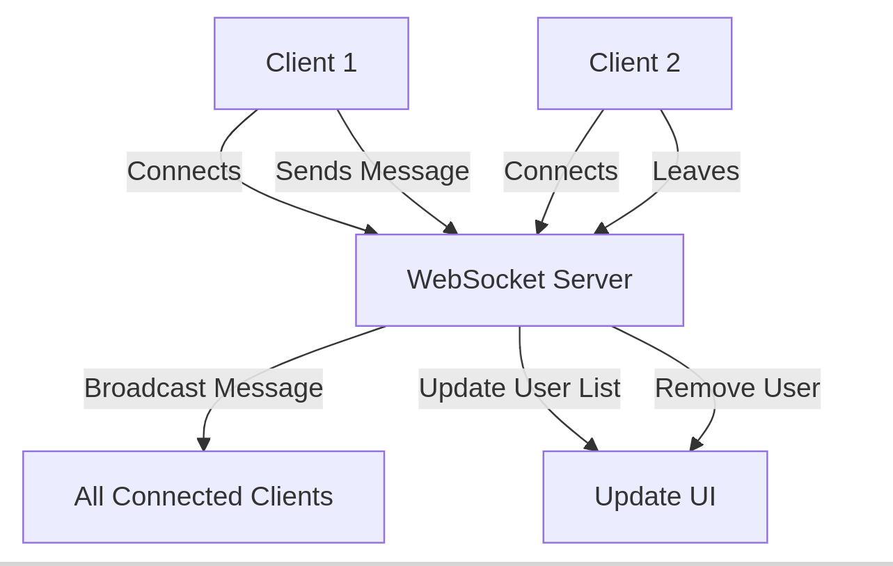

# Overview

The Peer-to-Peer Chat Application is a lightweight real-time chat system built with WebSocket technology. The project enables multiple users to connect to a chat server, broadcast messages, and view the list of online users.

# Key Features

Real-Time Communication: Users can send and receive messages instantly.

User Presence Tracking: Displays the list of currently connected users.

Broadcast Messaging: Messages are sent to all connected users.

Graceful Disconnection: Users leaving the chat are removed from the online users list.

---

# Project Structure

## Backend

Language: Go

Frameworks/Libraries:

Gorilla WebSocket: For WebSocket connections.

CloudyKit Jet: For template rendering.

BMizerany Pat: For routing.

### Key Files

handler.go: Implements WebSocket connection handling, message broadcasting, and user management.

routes.go: Defines HTTP and WebSocket routes.

main.go: Starts the server and listens for WebSocket channel events.

## Frontend

HTML Template: home.jet

CSS Framework: Bootstrap for styling.

JavaScript: WebSocket client handling user interactions and real-time updates.

---

# Application Flow

## Backend Flow
> HTTP Endpoint (/): 

* Renders the home page using the home.jet template.

> WebSocket Endpoint (/ws): 

* Upgrades HTTP connection to WebSocket.

* Tracks connected users.

* Listens for incoming WebSocket messages.

> Channel Listener:

* Processes WebSocket messages (username updates, broadcasts, and disconnections).

* Updates the online user list.

* Broadcasts messages to all connected clients.

## Frontend Workflow

> Connect to WebSocket: 
* Establishes a connection to the WebSocket server upon page load.

> User Interaction:

* Sends messages or updates username through WebSocket.

* Displays real-time updates to the chatbox and online users list.

> Graceful Disconnection: Notifies the server when the user leaves.

## Flow diagram

